## LAB02 Fundamentos01-Topología-básica

# Tecnologías: Router On A Stick, VLAN, DHCP, DNS, CDP, SSH 
# Herramientas: Vmware, Eve-NG, Wireshark, Microsoft Visio, Visual Studio Code

  

##  Descripción
En este laboratorio básico configuramos una topología de Router y Switch de acceso con 2 VLANS. 

Protocolos y Tecnologías trabajadas: VLAN, DHCP, DNS, CDP, SSH

1. Aplicamos configuración básica de acceso y seguridad en R1 y SW1.
- Configuramos banners y encriptación global de contraseñas
- Utilizamos el algoritmo SCRYPT para las contraseñas locales, la más recomendada por Cisco.
- Segmentamos tráfico en 2 vlans.
- Cambiamos la Vlan nativa para configurar una Vlan Nativa Muerta para evitar VLAN Hopping.
- Hacemos Shutdown a puertos no usados y además los configuramos como switchport de Vlan no Usada.
- Configuramos conectividad entre VLANS con Router on a Stick y subinterfaces.
- Configuramos DHCP y DNS en el router para las VLANS.
- Comprobamos configuraciones y analizamos tráfico en Wireshark de los distintos protocolos

2.  Configuramos VLANS y trunk en Router on a Stick.
3.  Probamos conectividad y protocolos de servicios como DHCP y DNS y capturamos el tráfico con Wireshark.
4. Probamos SSH y capturamos con Wireshark.

---

##  SKILLS
- Configuración Inicial y puesta en marcha de Switches y Routers Cisco
- Configuración de VLANS
- Configuración de interfaces
- Configuración/Troubleshooting de protocolos DNS, DHCP, SSH, CDP.
- Capturar tráfico y analizarlo en Wireshark
- Conocimiento de Protocolos
- Conocimiento seguridad básica

---

##  Topología de la Red
Microsoft Visio


###  Tabla de Direccionamiento 

| Dispositivo |   Interfaz  |  Dirección IP | Vlan |    Máscara    | Gateway Predeterminado | Descripción                          |
|:-----------:|:-----------:|:-------------:|:----:|:-------------:|------------------------|--------------------------------------|
| R1          |   e0/0.10   |  192.168.10.1 |  10  | 255.255.255.0 |           N/A          | Gateway Vlan 10 (Usuarios Ventas)    |
| R1          |   e0/0.20   |  192.168.20.1 |  20  | 255.255.255.0 |           N/A          | Gateway Vlan 20 (Usuarios Marketing) |
| R1          |   e0/0.99   |  192.168.99.1 |  99  | 255.255.255.0 |           N/A          | Gateway Vlan 20 (Gestión)            |
| SW1         | Vlan 99 SVI | 192.168.99.10 |  99  | 255.255.255.0 |      192.168.99.1      | IP de administración                 |
| Pc1         | eth0        | DHCP          | 10   | 255.255.255.0 |      192.168.10.1      | Host de prueba     Linux             |
| Pc2         | eth0        | DHCP          | 10   | 255.255.255.0 |      192.168.10.1      | Host de prueba      VPC              |
| Pc3         | eth0        | DHCP          | 20   | 255.255.255.0 |      192.168.20.1      | Host de prueba      VPC              |
| Pc4         | eth0        | DHCP          | 20   | 255.255.255.0 |      192.168.20.1      | Host de prueba       VPC             |


---

###  Configuración de dispositivos

Las configuraciones completas de cada dispositivo están disponibles en la carpeta [`configuraciones/`](./configuraciones):

| Dispositivo | Archivo | Descripción |
|---|---|---|
| Router R1 | [R1config.ios](./configuraciones/R1config.ios) | VLANs, subinterfaces, DHCP, SSH, DNS |
| Switch SW1 | [Sw1config.ios](./configuraciones/Sw1config.ios) | Trunk, VLANs, SVI de gestión |
| Router R1 (config base) | [Config Basic Router.ios](./configuraciones/Config%20Basic%20Router.ios) | Configuración acceso y seguridad básico |
| Switch SW1 (config base) | [Config Basic SW.ios](./configuraciones/Config%20Basic%20SW.ios) | Configuración acceso y seguridad básico |


###  Pruebas y Verificación

Verificamos conectividad, comandos aplicados y protocolos:


### Verificación de Configuración (show commands)

**Interfaces del Router R1**

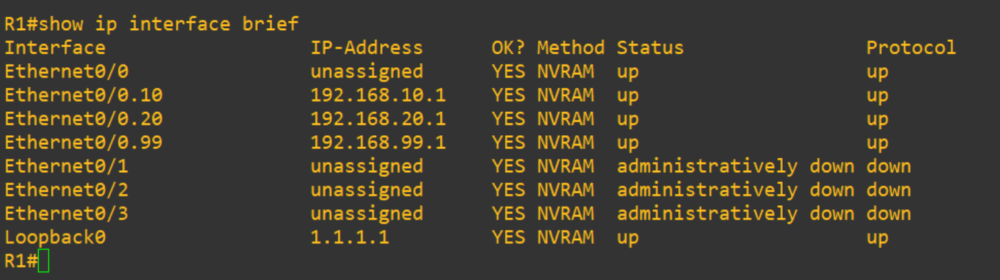

**Interfaces del Switch SW1**

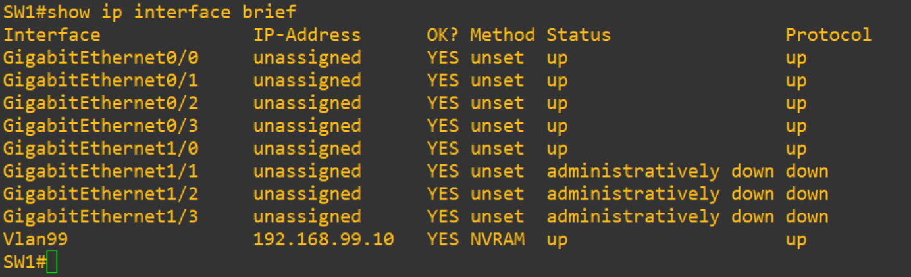

**Estado de las interfaces en SW1**

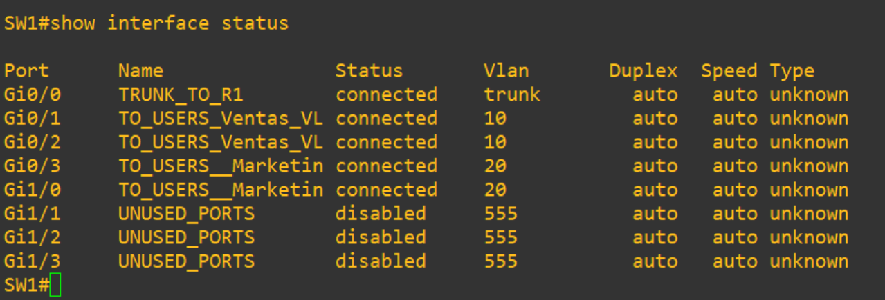

**Configuración de Trunk en SW1**

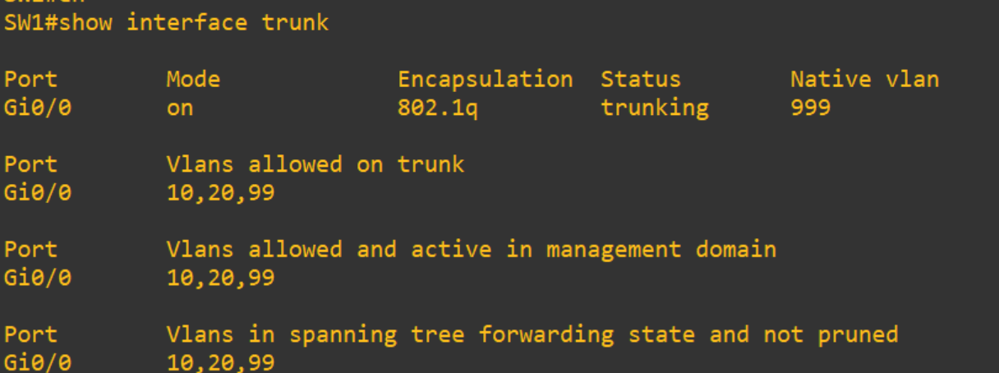


---

### Pruebas de Conectividad y Servicios

**Asignación de IP por DHCP en PC1 y Release**

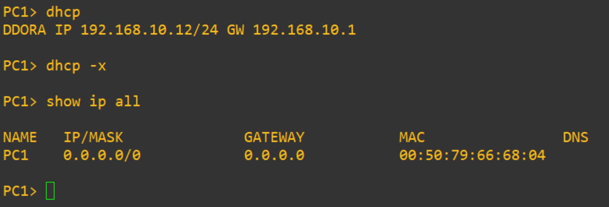

**Resolución DNS desde PC1 (la segunda linea falla al no tener IPv6 configurado)**

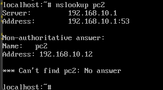

---
**Ping entre VLANs — PC1 a PC3, observamos como PC3 hace uso del ARP para conocer la MAC de la IP de su gateway y poder hacer ICMP Reply**

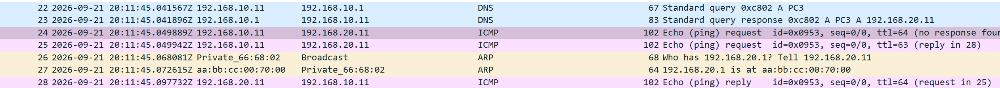

**Prueba de DNS y ping desde R1 hacia PC2**

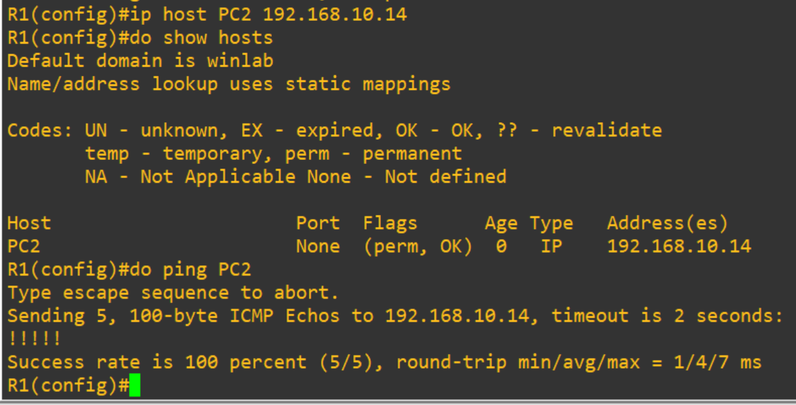

---

### Análisis de Tráfico (Wireshark)

**Captura del proceso DHCP en PC1**

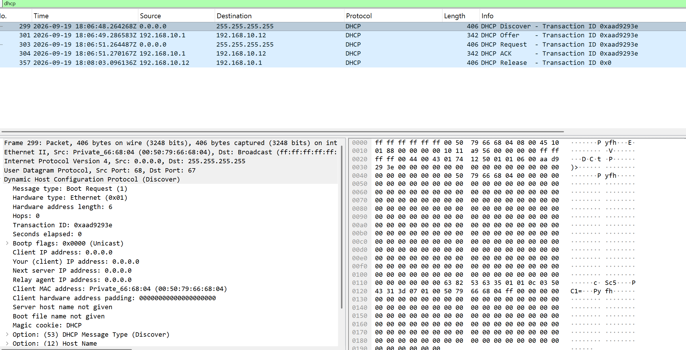

**Captura de resolución DNS y ping hacia PC2**

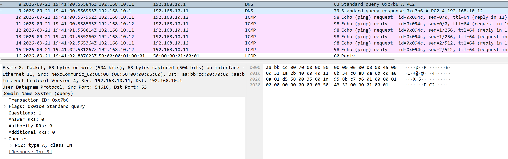

## Importante 

**Esta es la captura de tráfico CDP entre PC1 y SW1, el CDP es un protocolo que no debería ser activado en puertos de acceso ya que transmite información de la red y dispositivos la cual un atacante puede explotar para mapear la topología y hacer reconocimiento.**

**Este es el origen del mensaje CDP: Interface G0/1 en SW1**

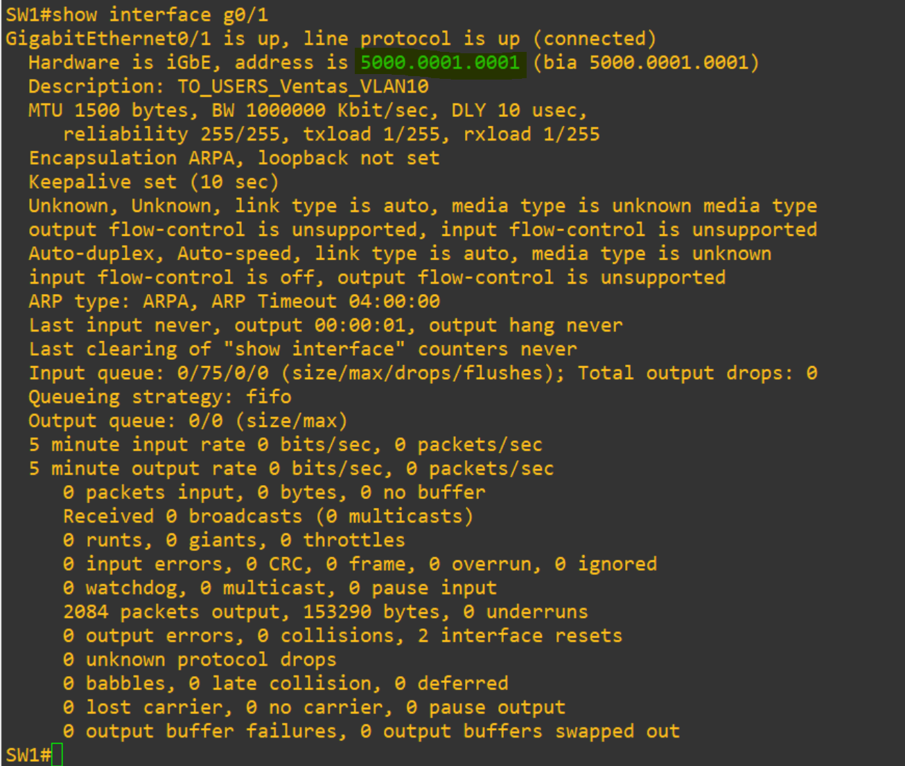

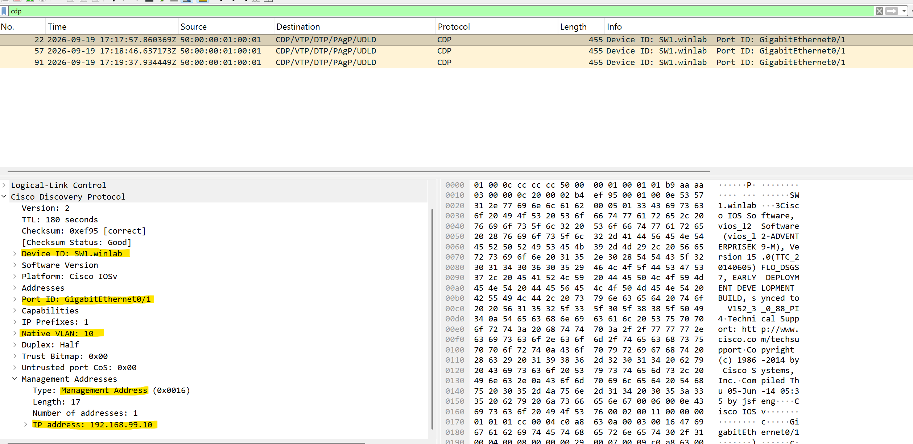

La mejor practica es desactivar CDP en puertos de acceso para evitar, ejemplo:
```
SW1(config)# interface g0/1
SW1(config-if)# no cdp enable

```
---

### Acceso Remoto (SSH)

**Conexión SSH desde PC1 hacia R1, hemos utilizado parametros opcionales para el tunel de cifrado y la autenticacion ya que la imagen de IOL no soporta las mas actualizadas**

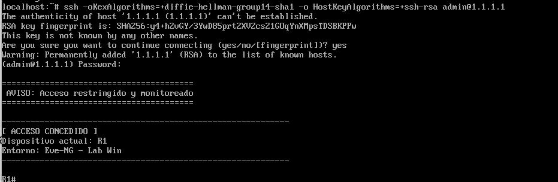

## 📁 Estructura del Repositorio
```text
├── Topologia Eve-NG/        # Archivo .unl exportado para replicar el laboratorio
├── configuraciones/         # Scripts limpios en formato .txt
│   ├── Config_Basica_SW.txt # Acceso SSH, banners y seguridad global
│   └── R1_Especifico.txt    # Subinterfaces ROAS y DHCP pools
├── imagenes/                # Capturas de pantalla de la topología y Wireshark
└── README.md                # Portada y documentación del proyecto
```